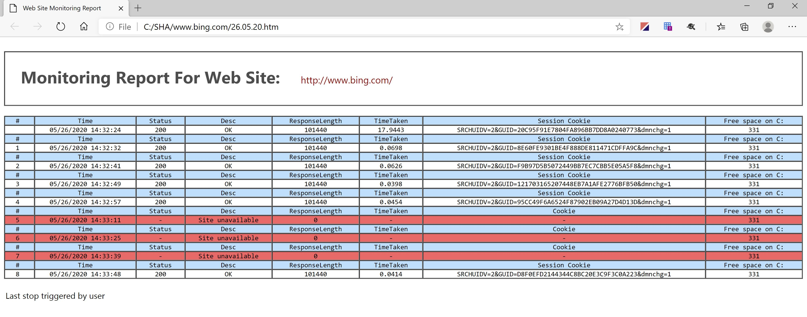

# Website_Availability_Monitor

Powershell script monitors availability of wesites to root cause sites exhibiting tempremental availability.

Two run modes exists:

Run script remotely to watch site and log detailed responses to HTML file output
On local IIS application host to monitor sites and processes, and capture nettrace & memory dump if necessary, with sendmail capability.

